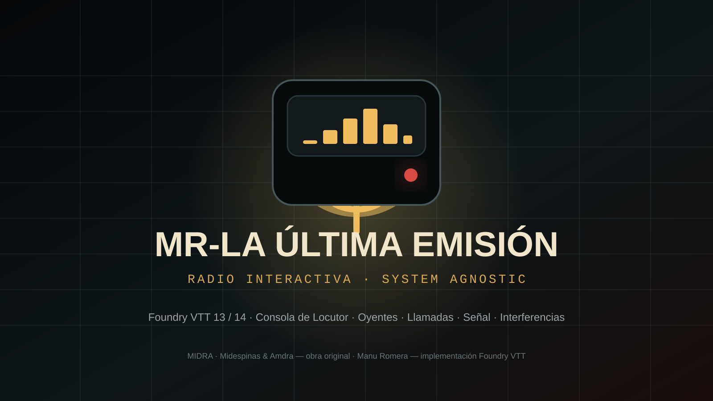

<div align="center">



# MR-La Última Emisión

**Una emisora de radio interactiva y agnóstica de sistema para Foundry VTT.**

[](#compatibilidad)
[](https://github.com/ManuRomera/mr-la-ultima-emision/releases/latest)
[](#funciones)

**Idea y obra original:** **MIDRA · Midespinas & Amdra**  
**Implementación del módulo para Foundry VTT:** **Manu Romera**

[Ver página del proyecto](https://manuromera.github.io/mr-la-ultima-emision/) · [Descargar última versión](https://github.com/ManuRomera/mr-la-ultima-emision/releases/latest) · [Derechos y créditos](RIGHTS.md)

</div>

---

## Una radio dentro de cualquier sistema

**MR-La Última Emisión** convierte cualquier mundo de Foundry VTT en una emisora de radio jugable sin sustituir el sistema que ya estés usando. No registra tipos de Actor ni Item, no modifica las reglas del juego activo y no exige una ficha concreta: la radio funciona como una capa independiente sobre el mundo.

El GM adopta el papel de **Locutor** y dispone de una mesa de emisión completa. Los jugadores pueden participar como **Oyentes**, solicitar entrar en antena, recibir información y seguir el estado de la transmisión mientras la escena muestra un panel público sincronizado.

> **La idea original, el concepto creativo y la obra de La Última Llamada pertenecen a MIDRA · Midespinas & Amdra.** Manu Romera es el creador de esta implementación modular para Foundry VTT, no del concepto original.

## Funciones

| Emisión | Oyentes | Mesa del Locutor | Calidad de vida |
|---|---|---|---|
| Panel público sobre la escena | Alias y frecuencia personal | Titular y mensaje público | Memoria de posición y tamaño |
| Estado y señal segmentada | Solicitudes privadas de llamada | Llamada en antena y cola | Recuperación de ventanas fuera de pantalla |
| Interferencias y avisos | Solicitudes concurrentes | Historial de llamadas | Memoria de pestañas |
| Mensajes de emisión al chat | Panel independiente del sistema | Notas privadas | `safeRender` mientras se escribe |
| Overlay movible y bloqueable | Sin tocar la ficha del PJ | Macros de control | Alto contraste, texto grande y movimiento reducido |

Además incluye i18n **español/inglés**, ayuda contextual mediante hover/clic derecho, navegación por teclado, API pública, diagnóstico, macros idempotentes y compatibilidad con Foundry VTT 13 y 14.

## Instalación

En Foundry VTT abre **Add-on Modules → Install Module** y usa este manifest:

```text
https://github.com/ManuRomera/mr-la-ultima-emision/releases/latest/download/module.json
```

También puedes descargar el ZIP desde la [última release](https://github.com/ManuRomera/mr-la-ultima-emision/releases/latest).

## Uso rápido

1. Activa **MR-La Última Emisión** en el mundo que quieras, independientemente del sistema de juego.
2. El GM abre la **Consola del Locutor** desde los controles del módulo o mediante las macros generadas.
3. Cada jugador abre su **Panel de Oyente**.
4. El Locutor decide qué sale al aire; las solicitudes privadas permanecen privadas hasta que se ponen en antena.
5. Activa el **panel público** para proyectar la emisión sobre la escena.

## Compatibilidad

- **Foundry VTT 13**: compatible.
- **Foundry VTT 14**: verificado.
- **Sistema de juego**: agnóstico; diseñado para convivir con cualquier sistema sin registrar documentos propios.

## API

```js
game.mrLaUltimaEmision.openStation();
game.mrLaUltimaEmision.openListener();
game.mrLaUltimaEmision.toggleOverlay();
game.mrLaUltimaEmision.diagnostics();
game.mrLaUltimaEmision.resetWindowLayout();
```

## Identidad MR

Este proyecto forma parte de la familia de herramientas **MR-** para Foundry VTT. El prefijo se usa tanto en el nombre visible como en los repositorios para agrupar los proyectos de forma reconocible y consistente.

## Derechos y créditos

**Concepto, idea original y obra de La Última Llamada:**  
**MIDRA · Midespinas & Amdra**

**Implementación técnica del módulo para Foundry VTT:**  
**Manu Romera**

La licencia del repositorio se aplica exclusivamente al código de la implementación cuando corresponda. No transfiere ni concede derechos sobre la obra original de MIDRA, Midespinas & Amdra. Consulta [RIGHTS.md](RIGHTS.md) para el detalle completo.
